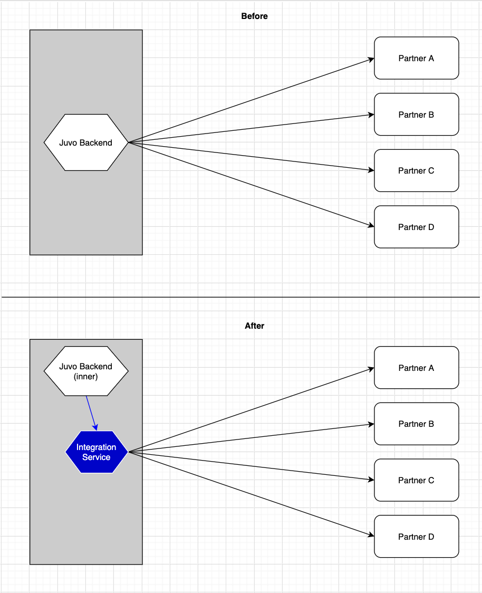

# Quick Background

## What is Juvo?

[Juvo](https://www.juvo.com/) is a fintech company that aims to build digital, financial identities for the world's underbanked population. In most of the countries Juvo is active in, the majority of people's monetary transactions are cash-based and therefore not necessarily stored in a digital manner. As such, it's difficult to prove financial strength as a consumer and easy for financial institutions to deny access to their services.

Juvo leverages non-traditional data sources (TelCos, mostly) to generate financial profiles and identities on their users. Then, Juvo offers micro-loans on cellular services to enhance that financial identity and introduce the concept of lending in a low-stakes, non-predatory way.

After all that, Juvo works with banks (and lenders) to offer the robust financial identities as a service.

Okay, that's Juvo at a high level. Now, on to the gRPC stuff...

## What is gRPC?

I recommend reading the [offical grpc doc](https://grpc.io/docs/guides/) to get a legitimate explanation. However, my over-simplified version is:

> A high-performance RPC framework that is built using protobufs as its IDL and HTTP/2 as its protocol.

## What is a protobuf?

Again, I recommend the [official protobuf doc](https://developers.google.com/protocol-buffers/docs/proto3). My version:

> A serialization format for storing and trasporting data. It's super-compact, machine-readable and language agnostic. Pretty neat.

# gRPC at Juvo

### The Problem

So, before building financial identities for the users in a given market, Juvo needs to integrate their data-processing and backend systems with the TelCo's. And, since each TelCo is different, this integration is unique each time. Over time, this became tedious as a lot of these partners had similar APIs with similar request & response models.

### The Solution

This was a prime opportunity to introduce a common interface for all API requests leaving Juvo's backend. This interface would be TelCo-agnostic in the sense that it the request and response models would be consistent across all partners. Even better, if this interface existed, Juvo could reuse a bunch more of their backend code since each integration did not have to be unique anymore -- at least at the innermost layer.

Introducing the Integration Service, powered by gRPC and protobufs...

- Protobufs are being used to define the consistent request and response models.
- gRPC is being used as the messaging protocol between our innermost backend service and our outermost one ("Integration Service").

Here's a little picture of an over-abstraction of what's going on:

Juvo is now using gRPC + protobufs as a means of enforcing a common interface across all partners and a few other things. Another cool thing is that if

## What's next for gRPC at Juvo?

1. Juvo interacts mostly with folks living in cash-based economies running off a pre-paid SIM card on 2G or 3G cell service. When those users interact with Juvo's services, the traffic is zero-rated; zero-rating is providing internet access without any financial cost. Unfortunately, their service is still tremendously slow. But, gRPC can help. Rather than making REST requests from our mobile clients (iOS, Web, Android), Juvo can start using gRPC and protobufs to reduce latency and the pure amount of bytes on the wire. Check out the protobuf [encoding doc](https://developers.google.com/protocol-buffers/docs/encoding) and [this comparison](https://medium.com/@EmperorRXF/evaluating-performance-of-rest-vs-grpc-1b8bdf0b22da) of gRPC and RESt

   > gRPC is roughly 7 times faster than REST when receiving data & roughly 10 times faster than REST when sending data for this specific payload.

2. Juvo partners, with what I consider to be, non-tech companies. As a result, a lot of the backend services that Juvo integrates with are old (bunch of SOAP), unreliable (tons of random errors) and slow (like, literal seconds). The good thing is that gRPC supports streaming APIs. So, if Juvo leveraged this properly, it means that wait times on the frontend AND backend could be reduced drastically as they will be receiving information as the Integration Service receives it from the TelCo.

## Resources:

- https://grpc.io/docs/guides/
- https://developers.google.com/protocol-buffers/docs/proto3
- https://blog.lelonek.me/a-brief-introduction-to-grpc-in-go-e66e596fe244
- https://medium.com/@EmperorRXF/evaluating-performance-of-rest-vs-grpc-1b8bdf0b22da
